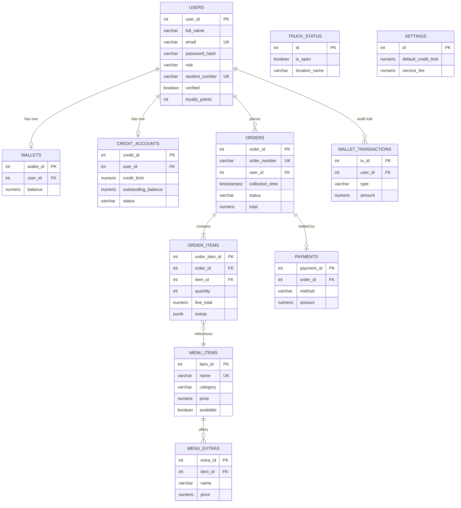

# Thabang Phala — Food Truck Ordering System

INSY7315 WIL · Task 2 · Group 20 (Kode Red)

A mobile-first ordering and payment system for Thabang Phala's food truck at Varsity College. Students order kotas ahead, pick a collection time and pay with a **prepaid wallet**, **card** or **Student Credit** (buy now, pay month-end). Thabang runs the truck from an **admin portal**: live order queue, menu and specials, student verification and credit limits, and reports.

| Part | Folder | Tech |
|---|---|---|
| Marketing website, student app (PWA), admin portal | `client/` | React 19 + Vite, React Router |
| REST API | `server/` | Node.js, Express 5, zod, JWT, bcrypt |
| Database | `server/src/db/` | PostgreSQL |
| Hosting | `render.yaml`, `client/vercel.json` | Vercel · Render · Neon (all free plans) |

## Entity Relationship Diagram

The database uses a single `users` table with a `role` column (STUDENT, GUEST, VENDOR, ADMIN), so students, vendors and admins all share one identity table.




## Run it locally

Prerequisites: Node.js 20+, and PostgreSQL running locally (or a free Neon database).

```bash
# 1. API
cd server
cp .env.example .env          # set DATABASE_URL
npm install
npm run db:seed               # creates tables + demo data
npm run dev                   # http://localhost:4000/api/health

# 2. Front end (new terminal)
cd client
cp .env.example .env
npm install
npm run dev                   # http://localhost:5173
```

Demo accounts (password `Password123!`):

| Role | Email |
|---|---|
| Student (verified, has credit) | lerato@vcconnect.edu.za |
| Student (pending verification) | kabelo@vcconnect.edu.za |
| Admin (Thabang) | admin@thabangphala.co.za |
| Vendor (staff) | vendor@thabangphala.co.za |

Run the tests: `cd server && npm test`

## Architecture

Layered client–server design with a REST API (Task 1 §9):

```
React client ──HTTPS/JSON──▶ routes/ (HTTP + validation) ──▶ services/ (business rules) ──▶ repositories/ (SQL) ──▶ PostgreSQL
```

- **Strategy pattern:** `services/paymentStrategies.js`, with Wallet, Credit and Card payment strategies.
- **Repository pattern:** `repositories/` keeps SQL out of the business logic.
- **Transactions:** orders, wallet and credit changes run in a single DB transaction with row locks, so a student can never be double-charged or go over their limit.

## API reference

All responses are `{ "data": ... }` or `{ "error": { "message", "details" } }`.

| Method | Endpoint | Who | Purpose |
|---|---|---|---|
| GET | `/api/health` | public | Health check (API + DB) |
| POST | `/api/auth/register` | public | Register (student number → student account) · 201 |
| POST | `/api/auth/login` | public | Log in → JWT (30 min) |
| GET / PATCH | `/api/auth/me` | logged in | View / update own details |
| GET | `/api/menu?category=` | public | Menu with extras |
| GET | `/api/menu/:id` | public | One item |
| POST | `/api/menu` | admin | Add item · 201 |
| PUT | `/api/menu/:id` | admin | Edit price, sale price, extras |
| PATCH | `/api/menu/:id/availability` | admin, vendor | Mark sold out / available |
| DELETE | `/api/menu/:id` | admin | Delete (409 if it has orders) · 204 |
| GET / PATCH | `/api/truck` | public / staff | Open status, location, hours |
| POST | `/api/orders` | logged in | Place order + pay · 201 (422 if credit/wallet declined, 409 if sold out) |
| GET | `/api/orders/mine` | logged in | Order history |
| GET | `/api/orders/:orderNumber` | owner, staff | Track an order |
| GET | `/api/orders?scope=active\|today` | staff | Live order queue |
| PATCH | `/api/orders/:orderNumber/status` | staff, owner (cancel) | Move through lifecycle · 409 for invalid moves |
| GET | `/api/wallet` | student | Wallet, credit, activity |
| POST | `/api/wallet/top-up` | student | Load wallet (R10–R2000) |
| POST | `/api/wallet/repay` | student | Repay credit from wallet or card |
| GET | `/api/admin/dashboard` | staff | Today's figures |
| GET | `/api/admin/reports?days=7` | admin | Sales by day, top sellers, payment mix |
| GET | `/api/admin/students` | admin | Students with credit balances |
| PATCH | `/api/admin/students/:id/verify` | admin | Verify a student |
| PATCH | `/api/admin/students/:id/credit-limit` | admin | Set a student's limit |
| GET / PATCH | `/api/admin/settings` | admin | Default limit, service fee, loyalty rate |

## Hosting

See [docs/HOSTING.md](docs/HOSTING.md). Live links:

- Website / app: _add after deploying_
- API: _add after deploying_

## Backup Plan (NFR-12)

The database runs on Neon PostgreSQL.

- **Automated backups:** Neon provides Point-in-Time Recovery (PITR) with a 7-day retention window on the free tier.
- **Manual weekly backup:** A `pg_dump` runs every Sunday at 02:00 SAST via a GitHub Action and is uploaded to a private cloud folder, keeping four weeks rolling.
- **Recovery procedure:**
  1. Open Neon Console → Project → Restore.
  2. Select a timestamp within the retention window.
  3. Neon creates a new branch with the restored data.
  4. Update `DATABASE_URL` in the hosting environment (Vercel/Render) to point at the restored branch.
  5. Smoke test `/api/menu` to confirm.

  
## Team

| Member | Role | Owns |
|---|---|---|
| Tadiwanashe (Tadi) Mapillar | UI development, APIs & hosting | `client/`, `server/src/routes/`, hosting |
| Boipelo Ntokozo Yende | Database | `server/src/db/`, `server/src/repositories/` |
| Liyabona Xinti | Business logic & data flow | `server/src/services/` |
| Molemo Chikane | Security & automated testing | `server/src/middleware/`, `server/tests/` |
| Muofhe Washu Mukheli | GitHub & DevOps | `.github/workflows/`, README |

## Presentation

_Add the link to the slides here._
